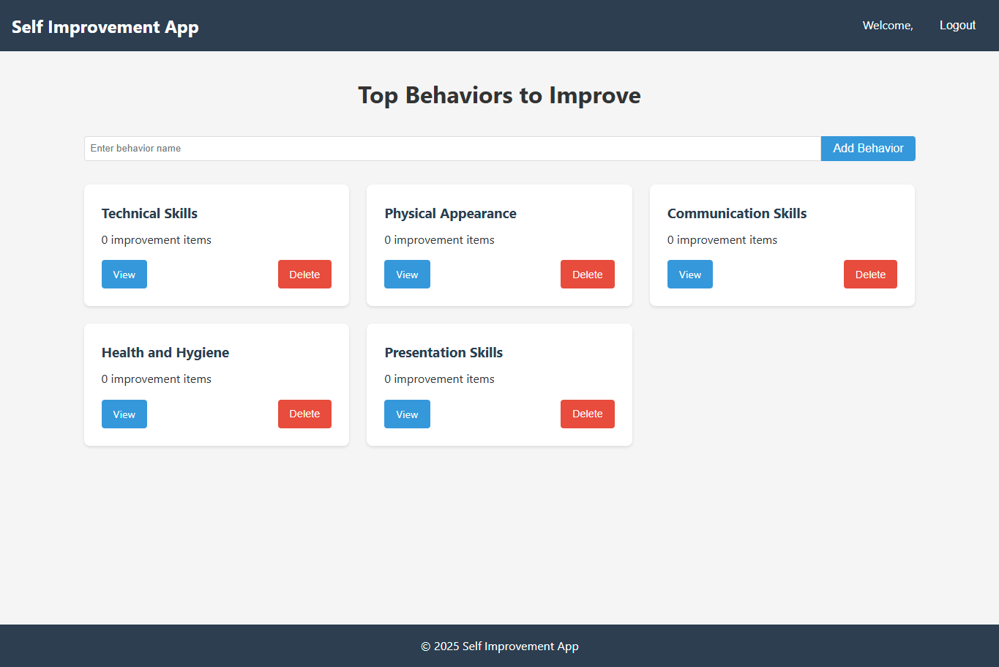

# Self-Improvement Tracker




A full-stack application to track and improve personal behaviors/habits, built with React (frontend) and Node.js (backend).

## Features
- User authentication (register/login)
- Create, view, and delete behaviors
- Add improvement todos to each behavior
- Track completion status
- Responsive UI

## Technologies Used
**Frontend:**
- React.js
- React Router
- Axios (API calls)
- Context API (state management)

**Backend:**
- Node.js
- Express.js
- MongoDB (with Mongoose)
- JWT Authentication

## Installation (Local Development)

### Prerequisites
- Node.js (v16+)
- MongoDB (local or Atlas URI)
- Git

### Setup Instructions

1. **Clone the repository**
   ```bash
   git clone https://github.com/your-username/self-improvement-app.git
   cd self-improvement-app
   ```

2. **Backend Setup**
   ```bash
   cd backend
   npm install
   ```

   Create .env file:
   ```bash
   MONGO_URI=your_mongodb_connection_string
   JWT_SECRET=your_jwt_secret_key
   PORT=5000
   ```

3. **Frontend Setup**
   ```bash
   cd ../frontend
   npm install
   ```
Update API URLs in src/services/ files if needed

4. **Run the Application**
   Start backend:
   ```bash
   cd ../backend
   npm start
   ```

Start frontend (in another terminal):
   ```bash
   cd ../frontend
   npm start
   ```

## Assignment Requirements Checklist
### ✅ Frontend:

1. Displays top 5 behaviors with most todos
2. Create/delete behaviors
3. Behavior detail page with todos
4. User-specific data

### ✅ Backend:

1. REST API for behaviors/todos
2. User authentication
3. MongoDB integration
4. JWT security

## Project Structure
```bash
self-improvement-app/
├── backend/
│   ├── controllers/
│   ├── models/
│   ├── routes/
│   ├── server.js
│   └── package.json
├── frontend/
│   ├── public/
│   ├── src/
│   │   ├── components/
│   │   ├── services/
│   │   └── App.js
│   └── package.json
└── README.md
```

### How to Use
1. Register a new account
2. Create behaviors (e.g., "Exercise", "Reading")
3. Add improvement items to each behavior
4. Track your progress